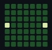
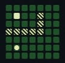
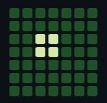
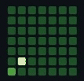

    
    
    

  

Welcome to **Grid Engine**!
Grid Engine helps you position and move objects on a **2-dimensional grid** in **JavaScript/TypeScript**.
It easily integrates with [Phaser.js](https://phaser.io/) but can also be used standalone. For example you could write your own renderer for an ASCII game. You can even run it on a server with [Node.js](https://nodejs.org/).

  

## Features

**Collision Detection** - Detect tile based collisions with the map and other objects, supporting collision groups and multiple layers.

**Pathfinding** - Efficient and configurable pathfinding allows moving to a target position or following other objects.

**Multi-tile Objects** - Allow objects to span multiple tiles on your grid.

**Isometric Maps** - Choose between isometric and orthogonal maps.

**Diagonal Movement** - Four and eight direction movement and pathfinding is supported.

  
  
  
  

## Docs

📖 Read our most current [documentation](https://annoraaq.github.io/grid-engine/) or [API reference](https://annoraaq.github.io/grid-engine/api/)

➡️ You can try/download [a list of examples](https://annoraaq.github.io/grid-engine/).

💻 [Install](https://annoraaq.github.io/grid-engine/p/installation) Grid Engine.

👾 Join our [discord](https://discord.gg/C4jNEZJECs).

🛠 Also check out the [Chrome DevTools plugin](https://github.com/zewa666/grid-engine-devtools).

## Projects using Grid Engine

- [Build a Snowman](https://play.google.com/store/apps/details?id=com.raiper34.buildasnowman)
- [Defynia](https://play.definya.com/)
- Fallout Clone [[Play](https://fallout-clone.netlify.app/)] [[Repo](https://github.com/slysnek/rs-clone)]
- [Névomon](https://nevomon.com/)

If you have a project that is using Grid Engine and that you would like to see in this list, post it in the #showcase channel on our [Discord](https://discord.gg/C4jNEZJECs).

## Special Thanks

Raiper34, splashsky, therebelrobot, xLink,

Most of the characters and tile set images for the examples are from: https://finalbossblues.com/.

## License

Apache 2.0
