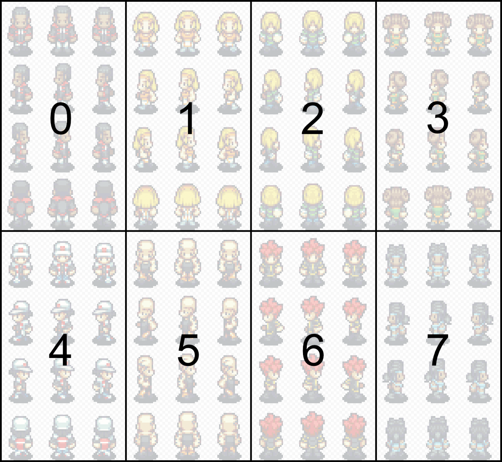

# Config

The data shape of the configuration object is described here.

### Config

* `characters: CharacterData[]`  An array of character data. Each describing a character on the map. 
* `firstLayerAboveChar: number` \(**DEPRECATED**, optional\)  In your tilemap, the index of the first layer that should be rendered on top of all the character layers. _**Deprecated.** Use_ [_`gm_alwaysTop`_](tilemap-layer-properties.md) _tilemap layer property instead._

### CharacterData

* `id: string`

  A unique identifier for the character on the map. If you provice two characters with the same id, the last one will override the previous one.  

* `sprite: Phaser.GameObjects.Sprite`

  The character's sprite.  

* `characterIndex: number` \(**DEPRECATED**, optional, default: 0\)

  _**Deprecated.** Use `walkingAnimationMapping` instead._  

* `walkingAnimationMapping?: number |`[WalkingAnimationMapping](config.md#walkinganimationmapping) \(optional\)

  In case of `number`: The 0-based index of the character on the spritesheet.

  Here is an example image showing the character indices:

  

  In case of [WalkingAnimationMapping](config.md#walkinganimationmapping): Alternatively to providing a characterIndex you can also provide a custom frame mapping. This is especially handy if your spritesheet has a different arrangement of frames than you can see in the example image \(4 rows with 3 columns\). You can provide the frame number for every state of the character.

  If both, a `characterIndex` and a `walkingAnimationMapping` is set, the walkingAnimationMapping is given preference.  

* `speed?: TileSizePerSecond` \(optional, default: 4\)

  The speed of a player in tiles per second.  

* `startPosition?: Phaser.Math.Vector2` \(optional, default: \(0,0\)\)

  Start tile position of the player.  

* `container?: Phaser.GameObjects.Container` \(optional\)

  A container that holds the character's sprite. This can be used in order to move more game objects along with the sprite \(for example a character's name or health bar\). In order to position the container correctly on the tiles, it is necessary that you position the character's sprite on position \(0, 0\) in the container. For more details see the [container example](https://github.com/Annoraaq/phaser-grid-movement-plugin/tree/master/examples/container)

### WalkingAnimationMapping

```text
{
  up: {
    leftFoot: number,
    standing: number,
    rightFoot: number
  },
  right: {
    leftFoot: number,
    standing: number,
    rightFoot: number
  },
  down: {
    leftFoot: number,
    standing: number,
    rightFoot: number
  },
  left: {
    leftFoot: number,
    standing: number,
    rightFoot: number
  }
}
```

