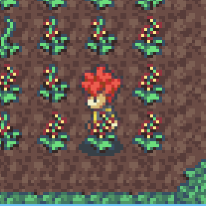

# Tilemap Layer Properties

There are some properties in your tilemap layers that you can use to control the rendering behavior of the tile layers.

* `gm_alwaysTop: boolean`

  If set to `true` the layer will always be rendered on top of all characters.  

* `gm_heightShift: number`

  This property indicates that the rows of the layer should get a depth sorting equal to characters. For characters their depth depends on the y-coordinate they are on. If a y-coordinate of a character is higher than that of another character, it means that the first character is more "south" on the map and therefore needs a higher depth than the second char. With tile-layers it is more complicated because sometimes one wishes the layer to be rendered on top of a character, if it's y-coordinate is greater OR EQUAL to the tile's y-coordinate. A common example for that use-case is high grass the char is walking through. You don't want the char to be above ALL grass tiles but only the ones north of the player. This can be done by giving the grass layer a `gm_heightShift` of `1`. Then the depth of the grass will be the y-coordinate + 1. So it will be on top of the player. An example can be seen in the examples directory. 

## 

