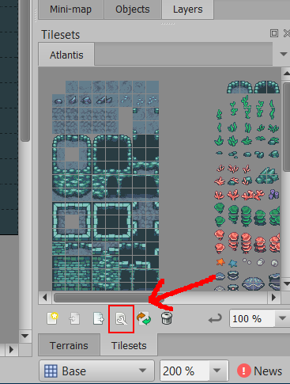
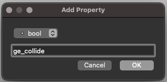

# Collisions

**Grid Engine** makes it super easy to enjoy tile-based collisions in your game, and even getting it set up is a breeze.

You can either read this guide, or check out the Medium article by @Annoraaq that's a tutorial for writing your own grid movement! [Here's the link.](https://medium.com/swlh/grid-based-movement-in-a-top-down-2d-rpg-with-phaser-3-e3a3486eb2fd)

Most tile-based features in **Grid Engine** work by using **Tiled**'s Custom Properties feature. Collision is no different! When working on your tilemap in **Tiled**, click **Edit Tilemap** in the bottom right menu.

Once you're in the tileset editor, select the tiles you want to have the custom property assigned to, and add a custom property in the left-hand menu.

Name it `ge_collide`, or one of the other [supported properties](../tile-properties), make it a `bool` and then set it to `true` if you want the tile to be non-walkable!

If you have several [character layers](../character-layers) or simply like to separate collisions from the graphical tiles, using [collision layers](../collision-layers) is a good practice.
