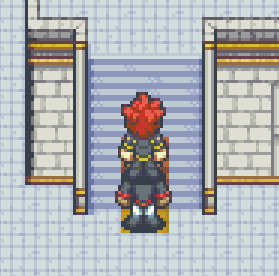

# Character Layers (Beta)

For many games it is important to support several layers that characters can be placed upon. Scenarios could be flying characters or higher layers like bridges.

Therefore the concept of **character layers** was introduced to GridEngine. Character layers have two impacts on GridEngine:

1. Rendering order
2. Collisions

Each character layer is mapped to a layer in the tilemap. The z-index (called depth in Phaser) of the character layer is determined by the z-index of the corresponding tilemap layer.
Simply put, collisions only take part within the same character layer. We will get into more details later.

Let's first look at character layers using two examples.

## Example 1: Flying Characters

One common use case for character layers is flying characters. Say you have a map with humans and flying creatures. You may want the flying creatures to move freely without colliding with items or characters on the ground. However, you want them to collide with other flying characters.


In order to achieve this, we create two character layers: **ground** and **sky**. In our code we can simply add the layers to the character configurations:

```javascript
gridEngine.create(tilemap, {
  characters: [
    {
      id: "player",
      sprite: playerSprite,
      walkingAnimationMapping: 6,
      startPosition: { x: 4, y: 4 },
      charLayer: "ground",
    },
    {
      id: "monster_bird_1",
      sprite: monsterBirdSprite1,
      startPosition: { x: 7, y: 7 },
      charLayer: "sky",
    },
    {
      id: "monster_bird_2",
      sprite: monsterBirdSprite2,
      startPosition: { x: 7, y: 8 },
      charLayer: "sky",
    },
    // ...
  ],
});
```

Now the monster birds will not collide with the player but with each other. However, you will notice that the player does not collide with the tilemap anymore.
Furthermore the player will be rendered on top of a bird in some cases:


This is because we need to tell GridEngine which layer on the tilemap our character layers **ground** and **sky** correspond to. Then GridEngine knows which tilemap layers to take into account for tilemap collisions and further it can derive the rendering order of the char layers.
To achieve that we will create a new tilemap layer for the sky:


It is important that the `sky` layer is above the `ground` layer. Otherwise the birds would be rendered below the ground layer.

Next we need to fill the whole `sky` layer with _invisible_ non-colliding tiles. By that I mean tiles that do not contain any pixels and are non-colliding. Why did I do that and not just leave those blank? The reason for this is the collision. If there is no tile at all on any collision-relevant tile layer for the current character layer, then GridEngine will handle the position as _colliding_. So _no tile_ is handled like a colliding tile.


We need to give the tilemap layer the property `ge_charLayer` with the value `sky`:


Now we add the layer property `ge_charLayer` with the value `ground` to the `ground` layer.

Now our two character layers behave as we intended. You can see the live example [here](../../examples/char-layers-flying-chars/index.html).

## Example 2: Layer Transitions

Another common use case for several character layers are structures like bridges.


As you can see in the image we want characters to be below the bridge as well as on top of it.

Let's start by building a tilemap that we can use to support this feature.

We will create a tilemap with 3 layers: `ground`, `buildings` and `bridge`. `ground` will have the floor tiles. `buildings` will have tiles from the buildings that should show up on top of the ground tiles. The uppermost layer `bridge` will contain the tiles of the bridge that will be on top of the characters below the bridge.


Here is how the `ground` layer looks like:


And here is how the `buildings` layer looks like:


There are two questions that may arise:

1. What the heck are those jugs for?
2. Why is the bridge incomplete?

The jugs are only representing colliding tiles. They will be invisible later because the `bridge` layer will hide those. However, I used them to create a collision barrier on the ground level. This does not allow the character to walk around freely "below" the building but only in the corridor.

The bridge is incomplete because we want the player to be able to walk below the upper part of the building later. This can be best shown with a picture:


Now let's finally take a look at the `bridge` layer:


This layer is supposed to show up on top of all characters on the ground level. It will also be important for the collisions of all characters on bridge level.

Take care of tiles marked with the red "!" on the screenshot. These are **invisible** tiles. I placed non-colliding tiles there that don't have any pixels. Why did I do that and not just leave those blank? The reason for this is the collision. If there is no tile at all on any collision-relevant tile layer for the current character layer, then GridEngine will handle the position as _colliding_. So _no tile_ is handled like a colliding tile.

But why aren't we taking a non-colliding non-invisible tile like the stairs tile to make it less confusing?


Well, the reason is that when leaving the bridge, this tile will overlap the upper part of our character, because she will already be on the `ground` char layer, which is below the bridge char layer. You can see the result here:


So now we need to make sure that characters on ground level do not collide with the bridge layer (and it's characters) and vice versa.

Therefore we set the `ge_charLayer` property of the `buildings` layer to `ground` and that of the `bridge` layer to `bridge` as shown in the last example.


Why are we giving the `ge_charLayer` property to the `buildings` layer and not the `ground` layer? Well, that is because we want the two layers `buldings` and `ground` to belong to the char layer `ground`. Or expressed differently: we want the chars of char layer `ground` to be rendered above both layers `ground` and `buildings`.
By assigning `ge_charLayer` to a tilemap layer we define inbetween which tilemap layers our chars will be rendered.
But which tilemap layers will be relevant for collisions of a certain char layer?
For every tilemap layer `l` with the layer property `ge_charLayer`, GridEngine will take all consecutive tilemap layers below `l` that do not have the `ge_charLayer` property and put them into the same collision group:


In our example the collision group `ground` will contain both tilemap layers `ground` and `buildings` because `buildings` has the `ge_charLayer` property and `ground` is below `buildings` and does not have the `ge_charLayer` property.

If we start our game now, we will see that you can walk below the bridge as intended. But if you try to walk up the bridge you will see your character disappear below the stairs...

We are missing one thing so far: layer transitions.

### Layer Transitions

In order to achieve this transition we simply use the `setTransition()` method of GridEngine. Let's write some code that will make sure that a character that enters the stairs will switch the layers correctly:

```javascript
gridEngine.setTransition({ x: 5, y: 9 }, "ground", "bridge");
gridEngine.setTransition({ x: 5, y: 10 }, "bridge", "ground");
```

The following image shows the corresponding tiles that hold the transitions:


The upper tile will make any character switch from `ground` layer to `bridge` layer on entering and the lower tile will make the character switch from `bridge` to `ground` again.

Why did we not pick the same tile for both transitions? We could do that but it will allow the character to switch layers in an unintended way: The layer transition happens on entering the tile. So if the player walks on that tile from the `ground` layer she will be transferred to the `bridge` layer. If the character then immediately walks down again she will still be on the `bridge` level but not on the bridge. This is not what we want. By having both transitions on adjacent tiles we ensure that this can't happen.

You can see the live example [here](../../examples/char-layers-bridge/index.html).

### What about `ge_alwaysTop`?

The `ge_alwaysTop` layer property is not needed anymore with character layers. In order to place layers on top of a character we simply need to make sure that the layers in the tilemap are on top of the tilemap layer with the corresponding char layer:


### What about shadows for the birds?

If they include a character shadow that is part of the character sprite and are rendered on the `sky` character layer like in example 1, we can observe that this shadow is rendered on top of other characters. One solution for this is shown in [this example](../../examples/char-layers-flying-chars-shadows/index.html).

## Unsolved Issues

There are unsolved issues when using character sprites that stretch over the size of multiple tiles. These issues impact the display depth (z-index) of character sprites. There can be ugly overlapping issues. The reason for this is that the whole sprite is rendered at the depth of the character layer. But some scenarios demand parts of the sprites to be rendered at different depths.

One example is our bridge example. We create a second character and let it follow our player. Then as soon as the player entered the bridge and gets transferred to the `bridge` character layer we stop. The following character will be one tile behind us but his head is rendered below our character. This is to be expected, because both characters are on different char layers. However, it is not the intended behaviour.



Under certain conditions you can avoid this overlapping by using the [layer overlay feature](../layer-overlay/index.html).
