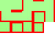
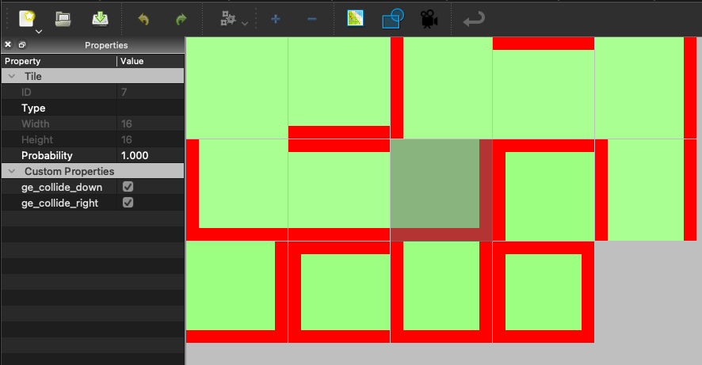
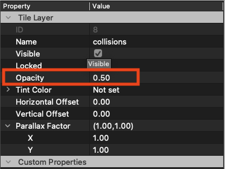
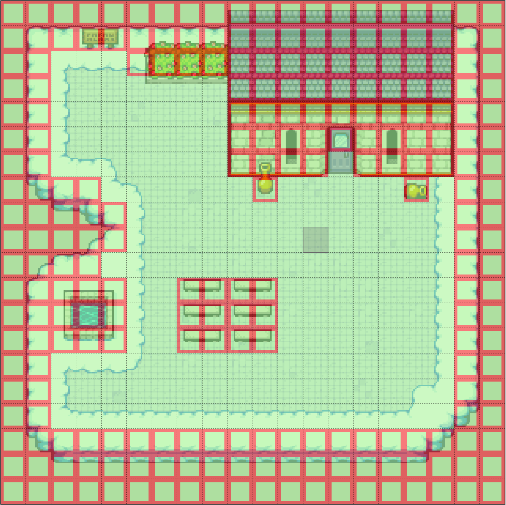

# Collision Layers

Whenever you want to separate collisions and graphical tiles or you have a complex map with several [character layers](../character-layers/index.html), collision layers is a good way to go.

What are collision layers?

They are no feature but a technique you can use to build your maps. Instead of having collision properties directly on your graphical tiles you create a special collision tileset.

For example a tileset like the following can be used for a 4-direction collision world:

> **_NOTE:_** For an 8-direction collision world you can create a similar tileset. Just use the [collision properties for 8 directions](../tile-properties/index.html#one-way)

A red border means that the tile blocks from this direction. Now you can add it as a tileset in tiled and give the corresponding collision tile-properties to the tiles (see also [collisions](../collision/index.html)):

Now we add a new layer to our map and make sure it is the topmost one (character layers are mentioned later).
We should now change the layer properties of the collision layer and set the opacity to 0.5:

Then we can start placing the corresponding tiles of our collision tileset to the map. You can either start by filling the map with non-colliding (green in our example) tiles or with all-colliding (red borders on all sides). Which one you take as a starting point depends on whether you have more coliding or non-colliding tiles in your map.

In a small example map the result can look like this:

You can already see that this gives a much better overview on which tiles are colliding and which ones are not. Moreover, you are more flexible with this approach because you can make the same tile colliding and non-colliding on the same map.

If you don't want to see the collisions, just hide the layer in Tiled.

## Character Layers

But what about [character layers](../character-layers/index.html)? Here you can also use collision layers and we even recommend it.
We need one collision layer for each character layer. Make the collision layer the topmost layer of a character layer that should be colliding. Or in other words, make the collision layer the layer that gets the `ge_charLayer` property. This way you ensure that it is visually on top of the other layers belonging to a character layer and it's not hidden by any colliding tiles of that layer.
