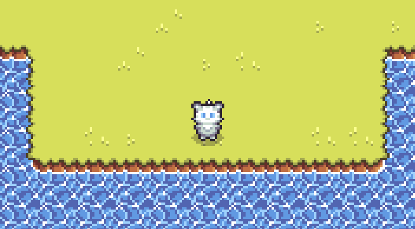
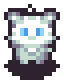
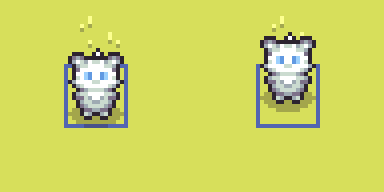

# Create Your First Game



This tutorial guides you step by step through creating your first game with Grid Engine and Phaser.js using Typescript.

## 1. Create a Phaser Game

The first step is to set up a [Phaser.js](https://phaser.io/) game.
There are several ways to do this. In this tutorial we use [Vite](https://vite.dev/) by cloning the official [phaser vite template](https://github.com/phaserjs/template-vite-ts).

### Use Github Template

Simply navigate to https://github.com/phaserjs/template-vite-ts and either clone this repository or create a repository from the template by clicking "Use this template". For more information, check out the github docs for ["creating a repository from a template"](https://docs.github.com/en/repositories/creating-and-managing-repositories/creating-a-repository-from-a-template).

To clone the repo run the following commands in your terminal:

```bash
mkdir my-grid-engine-game
```

```bash
git clone https://github.com/phaserjs/template-vite-ts.git my-grid-engine-game
```

```bash
cd my-grid-engine-game
```

```bash
npm install
```

You can test your game now by running:

```bash
npm run dev
```

If you navigate your browser to the displayed URL, you should see the example phaser game.

## 2. Install Grid Engine

Now it is time to install Grid Engine:

```bash
npm i --save grid-engine
```

We need to register Grid Engine as a phaser plugin in `main.ts`:

```ts
// src/main.ts
import { GridEngine } from "grid-engine"; // [!code ++]

// ...

const config: Types.Core.GameConfig = {
  // ...
  plugins: { // [!code ++]
    scene: [ { // [!code ++]
        key: "gridEngine", // [!code ++]
        plugin: GridEngine, // [!code ++]
        mapping: "gridEngine", // [!code ++]
      }, // [!code ++]
    ], // [!code ++]
  }, // [!code ++]
  // ...
};
```

## 3. Add a Tile Map

Before we add the tile map, let us add two more settings to the phaser game config:

```ts
// src/main.ts

// ...
const config: Types.Core.GameConfig = {
  // ...
  scale: {
    mode: Phaser.Scale.FIT, // [!code --]
    autoCenter: Phaser.Scale.CENTER_BOTH,
  },
  pixelArt: true, // [!code ++]
  // ...
};
```

`pixelArt: true` makes sure that the pixel graphics scale without getting
blurry.
We remove `mode: Phaser.Scale.FIT` for now, so that it does not scale up our game based
on the browser window size. Feel free to change that for your game later if you want.

Now it is time to add the actual tile map. Download [tilemap.json](../../assets/tilemap.json) and [grid-engine-tileset.png](../../assets/grid-engine-tileset.png) and put them into `public/assets`.
::: info
The tile map was created with [Tiled](https://www.mapeditor.org/) map editor. Check out our [collision tutorial](/p/collision/index.html) for more details about creating tile maps in Tiled for Grid Engine.
:::

Then in `src/scenes/Preloader.ts` add the following code to the `preload` method:

```ts
// src/scenes/Preloader.ts

export class Preloader extends Scene {
  // ...
  preload() {
    // ...
    this.load.image("tiles", "grid-engine-tileset.png"); // [!code ++]
    this.load.tilemapTiledJSON("tilemap", "tilemap.json"); // [!code ++]
  }
}
```

This makes sure the tile set and tile map get loaded.

In order to show the tile map in our game, we need to create it in the game scene:

```ts
// src/scenes/Game.ts

export class Game extends Scene {
  // ...
  create() {
    this.cameras.main.setZoom(4); // [!code ++]
    const tilemap = this.make.tilemap({ key: "tilemap" }); // [!code ++]
    tilemap.addTilesetImage("grid-engine-tileset", "tiles"); // [!code ++]
    for (let i = 0; i < tilemap.layers.length; i++) { // [!code ++]
      tilemap.createLayer(i, "grid-engine-tileset", 0, 0); // [!code ++]
    } // [!code ++]
  }
}
```

By setting the main camera zoom to `4` we make sure that our pixel graphic
assets are not rendered too small. Feel free to change the scale factor as you
prefer.

The remaining lines are responsible for creating an actual tile map in phaser
using our tile set and creating all the tile map layers.

If you run the game now you will notice that the camera is not positioned on the
center of the tile map yet. We will change that in the next step when we add our
player character!

## 4. Add a Player Character

Let's add "Fluffy" to our game!



Download [fluffy.png](assets/fluffy.png) and put it into the `public/assets` directory.

We make sure that our character spritesheet is available in our game scene by preloading it:

```ts
// src/scenes/Preloader.ts

export class Preloader extends Scene {
  // ...
  preload() {
    // ...
    this.load.spritesheet("fluffy", "fluffy.png", { // [!code ++]
      frameWidth: 16, // [!code ++]
      frameHeight: 20, // [!code ++]
    });
  }
}
```

Now we generate a sprite for our player character and make the camera follow it:

```ts
// src/scenes/Game.ts

export class Game extends Scene {
  // ...
  create() {
    // ...
    const playerSprite = this.add.sprite(0, 0, "fluffy"); // [!code ++]
    this.cameras.main.startFollow(playerSprite, true); // [!code ++]
    this.cameras.main.setFollowOffset( // [!code ++]
      -playerSprite.width / 2, // [!code ++]
      -playerSprite.height / 2 // [!code ++]
    ); // [!code ++]
  }
}
```

We give the camera an offset, so it is centered at the center of our player
character sprite and not at its upper left corner.

## 5. Initialize Grid Engine

To initialize Grid Engine we call its `create` method with a config object:

```ts
// src/scenes/Game.ts

export class Game extends Scene {
  // ...
  private gridEngine!: GridEngine; // [!code ++]
  // ...
  create() {
    // ...
    const gridEngineConfig = { // [!code ++]
      characters: [ // [!code ++]
        { // [!code ++]
          id: "fluffy", // [!code ++]
          sprite: playerSprite, // [!code ++]
          walkingAnimationMapping: 0, // [!code ++]
          startPosition: { x: 15, y: 14 }, // [!code ++]
          offsetY: -4, // [!code ++]
        }, // [!code ++]
      ], // [!code ++]
    }; // [!code ++]

    this.gridEngine.create(tilemap, gridEngineConfig); // [!code ++]
  }
}
```

We give `"fluffy"` as a character ID, use our previously created sprite and
choose a starting position of (15, 14), which is the center of the tile map.  We
set
[walkingAnimationMapping](https://annoraaq.github.io/grid-engine/api/interfaces/CharacterData.html#walkingAnimationMapping)
to `0`. If your character sprite sheet contains several characters this allows
to pick the right one.  Setting `offsetY` to `-4` lets the part of the sprite
where the feet touch the ground appear in the center of the tile. Otherwise the
character looks like it is standing on the bottom part of a tile.

The following image shows our character with (right) and without (left) offset:



## 6. Add Movement

The last step of our grid movement example is to add actual movement controls.
To achieve that we add an `update` method to our game scene and call the
corresponding movement methods of Grid Engine whenever the player presses an
arrow key:


```ts
// src/scenes/Game.ts

import { Direction, GridEngine } from "grid-engine"; // [!code ++]

export class Game extends Scene {
  // ...
  update() { // [!code ++]
      const cursors = this.input.keyboard?.createCursorKeys()!; // [!code ++]
      if (cursors.left.isDown) { // [!code ++]
        this.gridEngine.move("fluffy", Direction.LEFT); // [!code ++]
      } else if (cursors.right.isDown) { // [!code ++]
        this.gridEngine.move("fluffy", Direction.RIGHT); // [!code ++]
      } else if (cursors.up.isDown) { // [!code ++]
        this.gridEngine.move("fluffy", Direction.UP); // [!code ++]
      } else if (cursors.down.isDown) { // [!code ++]
        this.gridEngine.move("fluffy", Direction.DOWN); // [!code ++]
      } // [!code ++]
  } // [!code ++]
}
```

Congratulations! If you run the game now you are able to move fluffy around the
map using the arrow keys!

Of course, this is just the beginning. Grid Engine offers many more features.
Take a look at the tutorials, the [API
docs](https://annoraaq.github.io/grid-engine/api) or the examples to see what's
possible.


