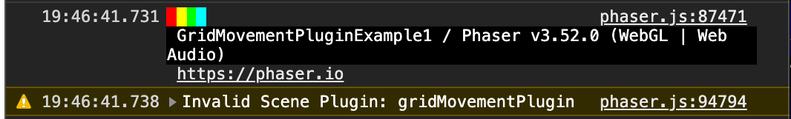

# Known Errors

Here are some issues we've come across, and how to fix them (if we've found a fix).

## Invalid Scene Plugin: gridEngine


This error will prevent loading of the plugin, and can occur if your bundler doesn't require `* as` for commonjs modules. To resolve this, try changing the following line:

```javascript
import * as GridEngine from "grid-engine";
```

to

```javascript
import GridEngine from "grid-engine";
```

## Clash with Phaser's default physics engine

Make sure that you disable the default physics engine's collisions for all the sprites that you add to the plugin. Otherwise you might be observing the inexplicable misplacement of characters.
