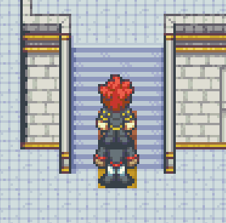

# Layer Overlay (Beta)

This feature can be enabled in the GridEngine configuration by setting `layerOverlay` to `true`.

It partially fixes the issue of overlapping characters when using [character layers](../character-layers/index.html).
When you have a character layer transition upwards and you have character sprites that are larger than one tile, then a lower character might be overlapped by a character that just made the transition up to a higher character layer. Here is an example picture:

With layer overlay enabled, this can be avoided under the condition that the character sprites **do not exceed a height of 2 tile sizes**.

Please keep in mind that this is still an experimental feature.

If you have larger character sprites then a workaround is to avoid layer transitions that occur through vertical movement (up or down) and try to put all your transitions to horizontal movements (left, right).
