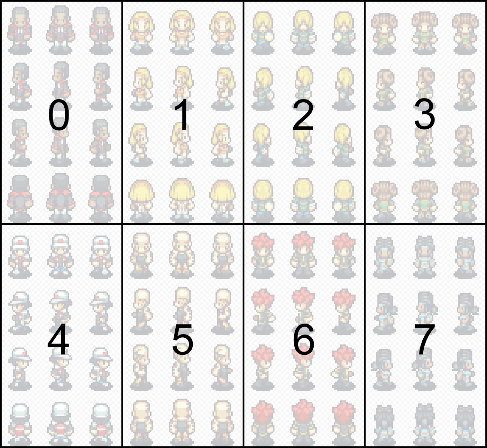

# Grid Movement Plugin for Phaser 3


## Usage

### Install package (npm):

Install the dependency:

```
npm i --save phaser-grid-movement-plugin
```

And import it to your code:

```javascript
import * as GridMovementPlugin from "phaser-grid-movement-plugin";
```

### Install package (web):

You can also download the `GridMovementPlugin.min.js` from the `dist` folder and import it via:

```html
<script src="GridMovementPlugin.min.js"></script>
```

In your GameConfig add:

```javascript
const gameConfig = {

  ...

  plugins: {
    scene: [
      {
        key: "gridMovementPlugin",
        plugin: GridMovementPlugin,
        mapping: "gridMovementPlugin",
      },
    ],
  },

  ...

};

const game = new Phaser.Game(gameConfig);
```

In your Scenes create method add:

```javascript
function create () {

  ...

  const gridMovementConfig = {
    characters: [{
      id: "player",
      sprite: playerSprite,
      walkingAnimationMapping: 6,
    }],
  };

  this.gridMovementPlugin.create(tilemap, gridMovementConfig);

  ...

}
```

That's all you need for a minimum configuration. See the examples folder for a complete example.

### Collisions

To enjoy the build in collision detection, your tiles need to have a custom boolean property called `collides`.
To read more about creating compatible tilemaps, take a look at my following blog post: https://medium.com/swlh/grid-based-movement-in-a-top-down-2d-rpg-with-phaser-3-e3a3486eb2fd.

## API

### Config

- `characters: CharacterData[]`
  An array of character data. Each describing a character on the map.

- `firstLayerAboveChar: number` (DEPRECATED, optional)
  In your tilemap, the index of the first layer that should be rendered on top of all the character layers.

  _Deprecated. Use `gm_alwaysTop` tilemap layer property instead._

### CharacterData

- `id: string`

  A unique identifier for the character on the map. If you provice two characters with the same id, the last one will override the previous one.

- `sprite: Phaser.GameObjects.Sprite`

  The character's sprite.

- `characterIndex: number` (DEPRECATED, optional, default: 0)

  _Deprecated. Use `walkingAnimationMapping` instead._

- `walkingAnimationMapping?: number | `[WalkingAnimationMapping](#walkingAnimationMapping) (optional)

  In case of `number`:
  The 0-based index of the character on the spritesheet.

  Here is an example image showing the character indices:

  

  In case of [WalkingAnimationMapping](#walkingAnimationMapping):
  Alternatively to providing a characterIndex you can also provide a custom frame mapping. This is especially handy if your spritesheet has a different arrangement of frames than you can see in the example image (4 rows with 3 columns). You can provide the frame number for every state of the character.

  If both, a `characterIndex` and a `walkingAnimationMapping` is set, the walkingAnimationMapping is given preference.

- `speed: TileSizePerSecond` (optional, default: 4)

  The speed of a player in tiles per second.

- `startPosition: Phaser.Math.Vector2` (optional, default: (0,0))

  Start tile position of the player.

- `container?: Phaser.GameObjects.Container` (optional)

  A container that holds the character's sprite. This can be used in order to move more game objects along with the sprite (for example a character's name or health bar). In order to position the container correctly on the tiles, it is necessary that you position the character's sprite on position (0, 0) in the container. For more details see the [container example](https://github.com/Annoraaq/phaser-grid-movement-plugin/tree/master/examples/container)

<a name="walkingAnimationMapping"></a>

### WalkingAnimationMapping

```
{
  up: {
    leftFoot: number,
    standing: number,
    rightFoot: number
  },
  right: {
    leftFoot: number,
    standing: number,
    rightFoot: number
  },
  down: {
    leftFoot: number,
    standing: number,
    rightFoot: number
  },
  left: {
    leftFoot: number,
    standing: number,
    rightFoot: number
  }
}
```

### Methods

- `create(tilemap: Phaser.Tilemaps.Tilemap, config: GridMovementConfig): void`

  Initializes the plugin. This method needs to be called before any other method. One exception is the `update` method. You are allowed to call it even before the `create` method (even though it will have no effect).

- `getPosition(charId: string): Phaser.Math.Vector2`

  Returns the tile position of the character with the given id.

- `moveLeft(charId: string): Phaser.Math.Vector2`

  Initiates movement of the character with the given id. If the character is already moving nothing happens. If the movement direction is currently blocked, the character will only turn towards that direction. Movement commands are **not** queued.

- `moveRight(charId: string): Phaser.Math.Vector2`

- `moveUp(charId: string): Phaser.Math.Vector2`

- `moveDown(charId: string): Phaser.Math.Vector2`

- `setSpeed(charId: string, speed: number): void`

  Sets the speed in tiles per second for a character.

- `setWalkingAnimationMapping(charId: string, walkingAnimationMapping: WalkingAnimationMapping): void`

  Sets the WalkingAnimationMapping for a character.

- `moveRandomly(charId: string, delay?: number = 0, radius?: number = -1): void`

  Initiates random movement of the character with the given id. The character will randomly pick one of the non-blocking directions. Optionally a `delay` in milliseconds can be provided. This represents the waiting time after a finished movement, before the next is being initiated. If a `radius` other than `-1` is provided, the character will not move further than that radius from its initial position (the position it has been, when `moveRandomly` was called). The distance is calculated with the [manhattan distance](https://en.wikipedia.org/wiki/Taxicab_geometry). Additionally, if a radius other than `-1` was given, the character might move more than one tile into a random direction in one run (as long as the route is neither blocked nor outside of the radius).

- `stopMovingRandomly(charId: string): void`

  Stops moving a character randomly.

- `moveTo(charId: string, targetPos: Phaser.Math.Vector2): void`

  Initiates movement toward the specified `targetPos`. The movement will happen along one shortest path. If no such path exists, the character will repeatedly check for a path to open up and remain still in the meantime.

- `addCharacter(charData: CharacterData): void`

  Adds a character on the go.

- `hasCharacter(charId: string): boolean`

  Checks whether a character with the given ID is registered.

- `removeCharacter(charId: string)`

  Removes the character with the given ID from the plugin.

- `follow(charId: string, charIdToFollow: string, distance: number = 0, closestPointIfBlocked: boolean = false)`

  Character `charId` will start to walk towards `charIdToFollow` on a shortest path until he has a distance of `distance` to the character to follow. If `closestPointIfBlocked` is set to `true`, the character will move to the closest point (manhattan distance) to `charIdToFollow` that is reachable from `charId` in case that there does not exist a path between `charId` and `charIdToFollow`.

- `stopFollowing(charId: string)`

  Character `charId` will stop following any character.

- `movementStarted(): Observable<[string, Direction]>`

  Returns an Observable that on each start of a movement will provide the character ID and the direction.

- `movementStopped(): Observable<[string, Direction]>`

  Returns an Observable that on each stopped movement of a character will provide it's ID and the direction of that movement.

- `directionChanged(): Observable<[string, Direction]>`

  Returns an Observable that will notify about every change of direction that is not part of a movement. This is the case if the character tries to walk towards a blocked tile. The character will turn but not move.

## Tilemap Layer properties

There are some properties in your tilemap layers that you can use to control the rendering behavior of the tile layers.

- `gm_alwaysTop: boolean`

  If set to `true` the layer will always be rendered on top of all characters.

- `gm_heightShift: number`

  This property indicates that the rows of the layer should get a depth sorting equal to characters. For characters their depth depends on the y-coordinate they are on. If a y-coordinate of a character is higher than that of another character, it means that the first character is more "south" on the map and therefore needs a higher depth than the second char. With tile-layers it is more complicated because sometimes one wishes the layer to be rendered on top of a character, if it's y-coordinate is greater OR EQUAL to the tile's y-coordinate. A common example for that use-case is high grass the char is walking through. You don't want the char to be above ALL grass tiles but only the ones north of the player. This can be done by giving the grass layer a `gm_heightShift` of `1`. Then the depth of the grass will be the y-coordinate + 1. So it will be on top of the player. An example can be seen in the examples directory.
  

## Troubleshooting

### `Invalid Scene Plugin: gridMovementPlugin`


This error will prevent loading of the plugin, and can occur if your bundler doesn't require `* as` for commonjs modules. To resolve this, try changing the following line:

```ts
import * as GridMovementPlugin from "phaser-grid-movement-plugin";
```

to

```ts
import GridMovementPlugin from "phaser-grid-movement-plugin";
```

### `Clash with Phaser physics engine`

Make sure that you disable collisions of the physics engine for all the sprites that you add to the plugin.
Otherwise you might be observing unexplainable misplacements of the characters.
